# Part I. Purpose, origin and analysis

# 1. Purpose and how to read this document

This is the single document that contains everything: the product vision and thesis as they were developed in the working session, the review of that material, the corrections, the refined specification with diagrams and schemas, and every decision taken so far. It is written to be read on its own. The fifteen companion documents (WRD-01 to WRD-15) go deeper into each subsystem and are the implementation references; where this document and a companion differ, the companion wins and this document must be updated.

The document has four parts:

- **Part I** explains where the material comes from, what the review found, and what was corrected.
- **Part II** is the refined specification v0.5, section by section, covering every topic of the drafts and adding the missing mechanics.
- **Part III** is the decision log: the 24 questions of the drafts' section 34 plus the decisions that emerged during the review, with the owner's answers applied.
- **Part IV** holds the appendices: terminology, the documentation set, the mapping from the drafts, and the review history.

Three areas carry the accent throughout, because the product will win or lose on them: **agent orchestration**, **integration with every kind of model access** (API keys, cloud identity, enterprise gateways, local models, vendor subscriptions), and **security**, meaning that an agent cannot get out of its sandbox, cannot do what it was not granted, and cannot take a credential with it.

> Working codename: **Warden**. Runtime daemon `wardend`, CLI `warden`, in-sandbox executor `warden-exec`. The name is a placeholder so that examples are concrete; the product name is deferred (D-25).

## 1.1 Document map

| ID | Document | What it decides |
|---|---|---|
| WRD-00 | Master Specification v0.5 (this document) | Everything at overview depth; analysis; decisions |
| WRD-01 | MVP Product Requirements Document | Scope, personas, journey, requirements, acceptance criteria, non-goals, discovery questions |
| WRD-02 | System Architecture Specification | Components, process topology, runtime API, trust boundaries, planes, repository structure |
| WRD-03 | Agent Manifest Specification v0.1 | Package format, manifest schema, capabilities, model policy, limits, delegation, signing |
| WRD-04 | Tool and Capability API Specification v0.1 | Tool descriptors, risk classes, capability grammar, executor protocol, built-in tools, MCP bridge |
| WRD-05 | Canonical Model API Specification v0.1 | Request and stream contract, provider catalog, adapters, auth and billing modes, harnesses, local models |
| WRD-06 | Model Routing Policy Specification | Data classifications, trust tiers, admission matrix, algorithm, fallback, budgets, policy syntax |
| WRD-07 | Workflow and Task DAG Specification | Workflow schema, scheduler, task state machine, retries, repair, cancellation, worktrees, planner contract |
| WRD-08 | Policy Engine Specification | Action request, decision, layers, invariants, rule syntax with CEL, approvals, explainability, CI mode |
| WRD-09 | Artifact, Event, and Audit Schema | Event envelope and taxonomy, hash chain, artifact records, provenance, storage, retention, export |
| WRD-10 | Threat Model and Security Requirements | Assets, attackers, threats and mitigations, sandbox design per OS, proxy, secrets, injection defenses, tests |
| WRD-11 | MVP User Experience Specification | Screens, states, approval prompts, diff review, CLI parity, errors, cancellation |
| WRD-12 | Evaluation Framework Specification | Suite format, fixtures, graders, metrics, gates, first 16 evaluation cases |
| WRD-13 | Deployment and Operations Guide | Installation per OS, configuration, provider setup, operations, updates, backup, troubleshooting |
| WRD-14 | Agent SDK Specification | Declarative versus coded agents, Agent Protocol, SDK surface, packaging, testing |
| WRD-15 | Enterprise Control Plane Specification | Identity and RBAC, registries, policy distribution, fleet, audit ingestion, analytics, offline behavior |

# 2. Origin of the material

The specification started as a product concept written by the founder and refined in a working session with GitHub Copilot in three iterations:

| Iteration | Content | Date on the draft |
|---|---|---|
| v0.1 | Original concept: 38 sections and three appendices. Vendor-neutral enterprise agent runtime; desktop application similar to Claude Code; principle "Agent ≠ Model ≠ Runtime ≠ Tool"; the runtime as trust boundary; DAG orchestration instead of a swarm; six workflow families (coding, UX, security, QA, DevOps, data); tool and capability system; MCP governed by the runtime; security list; context and memory; artifacts and provenance; observability; deployment models; Go plus Wails or Rust plus Tauri for the desktop; MVP; enterprise control plane; SDK; evaluation; business model; moat; risks; decisions; roadmap phases 0 to 5; repository structure; positioning options | (undated) |
| Review 1 | Copilot's analysis of v0.1: five strengths, ten improvement areas, a suggested documentation set and a next-decision sequence (reproduced in Appendix C) | |
| v0.2 | Refined draft, 36 sections, incorporating the ten improvements | |
| v0.3 | "DOCX-ready" version, 37 sections with MUST/SHOULD/MAY wording, section 34 "Required Decisions Before Implementation" (24 questions) and section 35 "Recommended Documentation Set" (15 documents) | September 24, 2026 |
| Review 2 | Copilot's verdict: a strong working specification, not yet an implementation specification; the next version should become technical, testable and implementation-oriented | |

This document is that next version. It keeps the thesis, corrects the mistakes, adds the mechanics the drafts left implicit, and answers the 24 questions.

# 3. Analysis of the drafts

## 3.1 What is strong and stays

- The product is the **execution and governance layer** between agents and AI infrastructure, not a chat application with a model selector. Model selection is becoming a commodity; controlled execution is not.
- **Agent ≠ Model ≠ Runtime ≠ Tool.** Agents are portable definitions; models are replaceable dependencies; the runtime is the trust boundary; tools are scoped capabilities.
- **The runtime decides.** "The model can propose an action. The agent can request an action. The runtime decides whether the action is permitted." This is the invariant every subsystem is built around, and it is testable: no tool executes without a preceding policy decision event.
- **DAG orchestration, not a swarm**, and "decompose only when useful".
- **Structured artifacts with provenance** as the output of work, not conversational text.
- **Coding as the beachhead**, with security, QA, DevOps and data workflows running on the same runtime later.
- **Control plane separated from execution plane** from the start, even though the MVP is local-first.
- **Verification as part of execution**: a task is not done because a file changed.

## 3.2 What went wrong, and the correction

Twenty-five problems were found. Each would have surfaced as rework or as a security hole during implementation.

| # | Problem in v0.1 to v0.3 | Why it matters | Correction in v0.5 |
|---|---|---|---|
| P-01 | The layer diagram places Tools and Enterprise Systems below the Provider Adapters and draws the Orchestrator as a layer under the Runtime. | Tools are invoked by the runtime, never by providers; the orchestrator is a component inside the runtime kernel. The diagram implied the wrong call graph and the wrong trust boundary. | Corrected layered architecture (Figure 1 in Part II §8). |
| P-02 | The example manifest carries two overlapping permission systems: fine-grained `capabilities` and a coarse `permissions` block. | Two sources of truth with undefined precedence produce bypasses and ambiguous audits. | One capability grammar (WRD-04); coarse summaries are derived for display only. |
| P-03 | `approvals: file_modification: denied` mixes approval gates with denials. | An approval is a gate for permitted-with-consent actions; a denial is the absence of a grant. | Approvals declare gates and scopes; denials are absent or denied capabilities. |
| P-04 | The security-reviewer example disables network but runs `semgrep` and `trivy`, which need rule and database updates; it also grants `${workspace}/**`, which includes `.env` and key files. | The example fails at runtime or leaks secrets. | Platform deny-list for secret paths applies to every agent; scanners use pre-provisioned databases or a per-tool egress allowlist through the proxy. |
| P-05 | Where model calls originate is never stated; with a sandbox that has no network, model calls cannot succeed. | The single most important security decision was undefined. | Model calls are made by the runtime on the host; the sandbox holds no credentials and has no direct network. |
| P-06 | Policy decision types include `retry_with_fallback` and `defer`, which are routing and scheduling outcomes. | Mixing concerns makes the engine untestable and the audit unclear. | Decision = effect (`allow`, `deny`, `approval_required`) plus obligations; fallback lives in the router, deferral in the scheduler. |
| P-07 | Provider list conflates protocol, hosting and authentication (vLLM and Ollama are OpenAI-compatible servers; Azure, Bedrock, Vertex are hosting and auth variants). | One adapter per vendor name multiplies code and hides the real axes. | Provider = protocol × auth mode × hosting/trust tier; six protocol adapters cover the market. |
| P-08 | No subscription, OAuth or vendor-harness path exists, and it is implicitly assumed that consumer-subscription tokens can be reused. | As of 2026 Anthropic and Google prohibit consumer-subscription OAuth tokens in third-party tools, OpenAI tolerates Codex OAuth, and GitHub's Copilot SDK is an officially supported subscription path. | New adapter kind **External Harness** running inside the sandbox with hooks routed to the policy engine; terms-aware billing modes; no token replay or client spoofing, ever. |
| P-09 | Provider unavailability was left open; a naive fallback would route confidential data from an internal model to an external one. | Availability-driven fallback is a data-leak channel. | Fallback moves only to the same or a lower trust tier; otherwise the task waits for input. |
| P-10 | Git worktrees are presented as the isolation mechanism. | Worktrees share `.git` (hooks, config, objects) and give no process or network isolation; a malicious repository executes code through hooks or install scripts. | Worktree = concurrency and merge isolation; sandbox = security isolation; hooks neutralized; global git config disabled. |
| P-11 | The MVP lists four agents and parallel research while the roadmap puts multi-agent orchestration in Phase 2; no acceptance criteria. | Scope creep and untestable "done". | MVP = one coding workflow with a fixed template; dynamic planning in Phase 2; acceptance criteria in WRD-01 §6. |
| P-12 | Task states are a flat list; `retrying` is a state; no transitions or terminal set. | Schedulers need a formal state machine to be correct and resumable. | Formal state machine with attempts, terminal states and a transition table. |
| P-13 | The inner agent loop is never defined, nor step, token and time budgets, nor context compaction. | This loop is the runtime. | Defined in Part II §13 with budgets as manifest fields. |
| P-14 | Sub-agents have no communication contract. | Shared chat between agents is the swarm anti-pattern. | Agents exchange only typed artifacts through task inputs. |
| P-15 | Cost telemetry assumes per-token pricing. | Subscription and harness modes have quota units, local models have infrastructure cost only. | Cost model records tokens, quota units and estimated currency where a price is known. |
| P-16 | "Tamper-evident event records" is stated, not designed. | Cheap early, painful to retrofit. | Hash-chained events with signed checkpoints. |
| P-17 | The desktop architecture embeds the runtime in the desktop shell while claiming the UI must not contain agent logic. | If the UI process hosts the runtime, the UI can bypass policy. | Runtime as a separate daemon with one authenticated local API; desktop, CLI and CI are clients. |
| P-18 | Data classifications are mentioned but never defined; provider trust is not modeled. | "Which data may go to which model" cannot be enforced. | Four classifications and five trust tiers with a default admission matrix. |
| P-19 | Prompt injection is listed as a threat with no mechanism. | Repository content and tool output are the main attack surface. | Provenance-tagged untrusted content, taint tracking, capability drop, approval escalation, MCP description pinning. |
| P-20 | Nothing prevents a repository-committed configuration from widening permissions. | An instant bypass in a malicious repository. | Workspace-level policy can only restrict. |
| P-21 | Manifests have no execution limits and no delegation rights. | Runaway loops and unbounded sub-agents. | `limits` and `delegation` sections. |
| P-22 | The SDK "allows code" but where it runs is undefined. | Agent code inside the runtime process is inside the trust boundary. | Coded agents run inside the sandbox through the Agent Protocol. |
| P-23 | Local models treated as interchangeable with frontier models. | Many lack native tool calling, JSON mode or large context. | Capability catalog; emulated tool calling; small-context strategies. |
| P-24 | Windows sandboxing not addressed. | Native Windows options are weaker. | Windows uses the container backend in the MVP. |
| P-25 | Draft dated September 24, 2026. | Housekeeping. | This set is dated September 25, 2026. |

## 3.3 Consolidated position on the three accent areas

**Orchestration.** One kernel loop, one scheduler, typed artifacts, a fixed workflow template for the MVP, dynamic planning later on the same schema.

**Model integration.** Every access mode is modeled explicitly (API key, cloud identity, gateway, none for local, vendor harness). The canonical API, the router and the policy engine treat them uniformly; only the trust tier and the billing mode differ. Enterprises pay through API keys and cloud identity; subscriptions matter for individuals and small teams and are supported only where the vendor permits.

**Security.** The sandbox enforces "cannot get out", the policy engine enforces "may not do", the proxy and the secrets broker enforce "cannot take anything with it". All three are mandatory in the MVP.

# Part II. Refined specification v0.5

# 1. Executive summary

The product is a vendor-neutral **enterprise AI agent runtime and integration platform**. It enables organizations to build, deploy, orchestrate, govern and execute AI agents using the models, tools, infrastructure and enterprise systems they already own or operate.

The first product experience is a desktop application with a developer workflow similar to Claude Code. The desktop is only the first client. The fundamental product is an independent agent runtime that supports:

- Desktop applications
- Command-line interfaces
- CI/CD pipelines
- Remote workers
- Enterprise servers
- Private-cloud environments
- On-premises installations
- APIs and embedded enterprise applications

The platform sits between AI agents, AI models, enterprise tools, execution environments, organizational policies, and users and approval systems.

The foundational architectural principle is **Agent ≠ Model ≠ Runtime ≠ Tool**. An agent defines a role, objective, instructions, tools, permissions and expected behavior. A model provides reasoning, generation, classification or other AI capabilities. The runtime executes the agent, manages state, enforces permissions, controls tool access, applies policy and records events. The model router determines which approved model or provider performs a specific task.

The strategic goal: **the secure runtime for enterprise AI agents.**

# 2. Product vision

Organizations should be able to bring their own AI models, AI infrastructure, agents, tools, enterprise data, policies and deployment environments, and then execute and govern those assets through one consistent runtime.

The platform lets an enterprise define which agents are approved, which models they may use, which tools they may access, which data they may process, where they may execute, which actions require approval, how their work is verified, how their activity is audited, and how much their execution costs.

The long-term product is therefore not a coding assistant. It is an enterprise AI execution and governance layer.

# 3. Product thesis

Organizations increasingly operate mixed AI environments: commercial frontier models, cloud-provider AI services, enterprise-hosted models, self-hosted open-source models, OpenAI-compatible endpoints, internal AI gateways, and specialized security, coding, analytics or knowledge models. At the same time, AI agents require access to sensitive systems: source code, filesystems, databases, cloud infrastructure, CI/CD, ticketing, communication platforms, credentials, internal documents, production and development environments.

Core thesis: **customers own or control their models, infrastructure, agents, tools and data; they need a trusted runtime to make those assets work together safely.**

The product does not compete primarily on model quality. Its differentiation comes from secure execution, model and provider neutrality, agent portability, tool governance, workflow orchestration, policy enforcement, auditability, evaluation, cost intelligence, and private and on-premises deployment.

# 4. Problem definition

| Problem | Detail |
|---|---|
| 4.1 Model and vendor lock-in | Agent workflows become coupled to one vendor, SDK or application, which makes it hard to change providers, use internal models, route sensitive data differently, optimize cost, recover from outages, or use specialized models |
| 4.2 Fragmented agent development | Teams create agents without consistent packaging, permissions, evaluation, versioning, distribution, security review or observability |
| 4.3 Unsafe execution | Agents get shells, filesystems, networks, cloud environments, databases, credentials and enterprise APIs without a consistent execution boundary |
| 4.4 Lack of governance | Security, platform and compliance teams cannot see which agents ran, who initiated them, which models and tools were used, which data was accessed, which policies applied, what was approved or denied, what was produced, and what it cost |
| 4.5 Inefficient AI infrastructure usage | No principled way to decide between a frontier model, a cheaper commercial model, an internal model, a self-hosted model, or a specialized coding or security model |
| 4.6 Increasing workflow complexity | Useful work needs research, planning, implementation, testing, security review, deployment validation, documentation and approval, with dependencies, parallelism, verification, retries and auditability |

# 5. Product positioning

Primary: **The secure runtime for enterprise AI agents.**

Alternatives kept from the drafts: "Bring your own models. Run your own agents. Govern them in one runtime."; "The execution and integration layer between enterprise agents and enterprise AI infrastructure."; "A vendor-neutral operating layer for enterprise AI agents."

Avoid "a coding assistant with more models": it makes model selection the value proposition, and model selection is commoditizing. The stronger frame is "a trusted runtime that determines how enterprise AI agents are allowed to operate."

# 6. Core product principles (now with the test that proves each)

| Principle | Statement | Test that proves it |
|---|---|---|
| 6.1 Agent is not a model | An agent is portable across models unless it explicitly requires a capability | The same manifest runs on two providers of different protocols without edits |
| 6.2 Models are replaceable dependencies | Any approved commercial, cloud, internal or self-hosted model through the platform's model interface | Adding a provider touches no agent |
| 6.3 The runtime is the trust boundary | The model suggests, the agent requests, the runtime decides | No tool executes without a preceding decision event |
| 6.4 Least privilege is the default | Only the tools, paths, network, credentials and privileges required | A sandbox exposes exactly the worktree, a read-only toolchain and the proxy socket |
| 6.5 Tools are capabilities | A tool connection never grants unrestricted authority | MCP servers get per-tool grants |
| 6.6 Verification is part of execution | Completion requires tests, builds, analysis, security checks, policy checks, human approval where appropriate | A coding task cannot succeed without its verification tasks |
| 6.7 Everything important is observable | Structured events for execution, model calls, tool calls, decisions, approvals, failures, artifacts, costs, verification | Every such event is in the hash chain |
| 6.8 Decompose only when useful | Simple tasks take a simple path | The planner justifies each task in the plan artifact |
| 6.9 Parallelize independent work | When isolation and resource policy permit | Parallel tasks have disjoint path sets and separate worktrees |
| 6.10 Desktop is a client, not the platform | The runtime is independent of the UI | The CLI reproduces every desktop action |
| 6.11 Enterprise deployment considered early | Local, private cloud, on-premises, hybrid, restricted networks | Contracts for bundles, registries and event sync fixed in the MVP |

# 7. Product scope

## 7.1 Initial product

A local-first desktop development environment providing conversational and CLI-style interaction, repository exploration, planning, controlled code modification, isolated git worktrees, build and test execution, security review, model and provider selection, approval gates, execution history, structured artifacts, audit events, usage and cost telemetry.

## 7.2 Workflow families (from v0.1, kept as the expansion path)

| Family | First use cases | What it adds to the runtime |
|---|---|---|
| A. Coding | Bounded feature changes, bug fixes, refactors, tests | The MVP |
| B. UX and design | Component specs, accessibility review, design-to-code | Design artifacts, browser tool |
| C. Security | Diff review, dependency audit, secret scanning, threat notes | Scanner profiles, security report artifact (read-only agents in the MVP) |
| D. QA | Test generation, flake analysis, coverage gaps | Test tooling profiles, hidden-test evaluation |
| E. DevOps | CI failure triage, infrastructure change proposals, runbook execution with approvals | Cloud and Kubernetes tools, host-effect approvals |
| F. Data | Migrations, data quality checks, report generation | Database tools with classification-aware routing |

## 7.3 Long-term product

Agent runtime, workflow orchestration engine, agent registry, model registry, provider adapters, tool and capability system, policy engine, evaluation framework, enterprise control plane, remote workers, enterprise integrations, observability and cost intelligence.

## 7.4 Non-goals

Not a generic chat application; not a thin wrapper over model APIs; not a fixed agent swarm; not an unrestricted autonomous system; not a public marketplace for every kind of agent; not a replacement for every enterprise system; not a model-training platform; not a fully autonomous production deployment system; never a token-replay or client-spoofing path to consumer subscriptions.

# 8. Conceptual architecture (corrected)

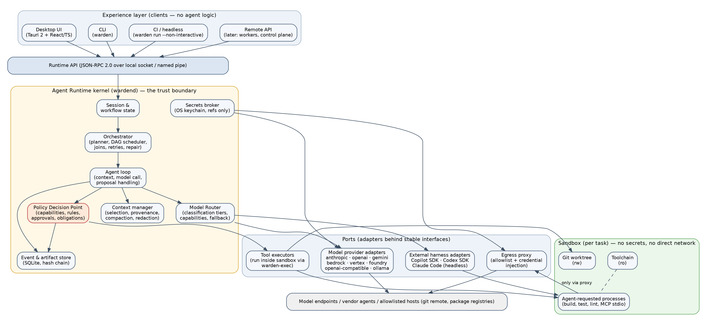

What changed against the drafts' diagram (P-01): the orchestrator, the agent loop, the Policy Decision Point, the router, the context manager, the secrets broker and the audit store are components of one kernel; provider adapters and tool executors are peers behind the kernel; tools are reached only from the executor port into the sandbox; model endpoints are reached only from the provider port. The only path from a model suggestion to an effect in the world is: model output → agent loop → Policy Decision Point → executor inside the sandbox (or a host-scoped executor for a small set of host-effecting operations that always require approval).

# 9. Execution plane and control plane

**Execution plane** (exists in the MVP): sessions, tasks, model calls, tool execution, policy enforcement, sandboxes, worktrees, artifacts, audit events, approvals, cancellation and timeouts. It may run on a workstation, in a CI worker, on a private server, in a private cloud, on an on-premises worker, or in a managed remote worker.

**Control plane** (Phase 3): identity and SSO, RBAC, agent registry, model registry, provider configuration, policy publishing, credential references, deployment management, evaluation management, central audit, usage and cost analytics, worker and fleet management.

The MVP fixes the contracts the control plane will feed later:

| Contract | MVP source | Control-plane source |
|---|---|---|
| Policy bundle | `~/.warden/policy/*.yaml` | Signed bundle with TTL, cached |
| Agent package | `~/.warden/agents/` | OCI registry, digest-pinned, signed |
| Model catalog | `~/.warden/models.yaml` | Model and provider registry with tiers |
| Events | Local SQLite | Local SQLite plus streaming to audit ingestion |
| Identity | OS user | OIDC identity token bound to the daemon |

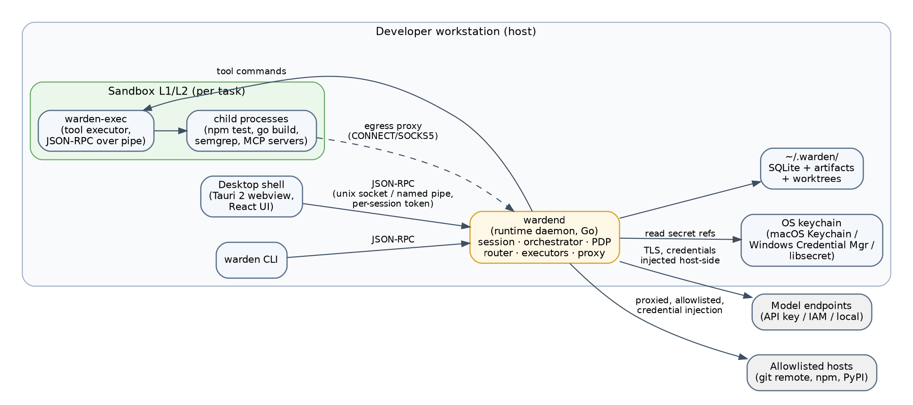

Process rules: `wardend` is a per-user daemon exposing JSON-RPC 2.0 over an owner-only Unix socket (named pipe on Windows) with a per-session token; the desktop shell (Tauri 2) bundles the daemon as a sidecar and never links it as a library; the CLI is the same Go module; `warden-exec` is the only process the runtime launches inside a sandbox, and every agent-requested process is its child.

# 10. Core runtime primitives

| Primitive | Definition |
|---|---|
| Workspace | A repository or directory the user opens; carries a data classification and policy references |
| Agent | A role-specific worker with instructions, tools, permissions and behavior, packaged with a manifest |
| Model | A reasoning, generation, classification or embedding engine, described by a catalog entry with capabilities and a trust tier |
| Provider | A service or endpoint exposing one or more models: protocol × auth mode × hosting |
| Tool | A controlled capability available to an agent, with schemas, a risk class and an executor location |
| Capability | A specific operation and resource scope granted by manifest and narrowed by policy |
| Task | A bounded unit of work with defined inputs and outputs |
| Execution | One attempt of a task in one sandbox |
| Workflow | A graph of tasks and dependencies with joins, gates, retries and repair rules |
| Policy | A rule controlling models, tools, data and actions, producing an effect and obligations |
| Session | Persistent interaction and execution state for a user in a workspace |
| Artifact | A typed, content-addressed output produced by a task or workflow |
| Approval | Human or system authorization for a sensitive action, with a scope and expiry |
| Event | A structured, hash-chained record of an execution occurrence |
| Worktree | An isolated git workspace for code modifications (concurrency isolation, not security isolation) |
| Sandbox | The per-task security isolation boundary (L1 native, L2 container, L3 microVM) |
| Evaluation | A repeatable test of agent or workflow quality |

# 11. Agent model

An agent is declarative wherever possible, with optional code for advanced behavior. The agent definition tree from the drafts is kept:

```
Agent
├── identity, version, role, purpose
├── instructions
├── input schema, output schema
├── tools and capabilities (paths, commands, egress, constraints)
├── model requirements and preferences
├── execution limits (steps, tokens, time, cost)
├── approval requirements
├── artifact contracts (produces, consumes)
├── delegation rights
├── evaluation references
├── runtime compatibility and minimum sandbox level
└── observability metadata
```

Separation of concerns: the **Agent Manifest** defines identity, requirements, permissions and contracts; the **Agent Implementation** (optional, Phase 4) defines prompts beyond the manifest, logic, state machines or SDK code and runs inside the sandbox; the **Workflow Definition** defines tasks, dependencies, sequencing, approvals, retries and artifacts.

# 12. Agent manifest

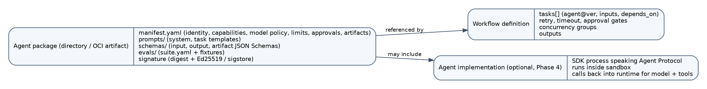

The manifest defines: API and schema version; identity and version; purpose and role; input and output schemas; tool and capability grants (paths, commands, egress, constraints); model requirements; execution limits; approval requirements; artifact contracts; delegation rights; evaluation references; package integrity metadata; runtime compatibility. Authored in YAML, canonicalized to JSON for hashing and signing (D-01, D-02).

## 12.1 Corrected example (compare with the drafts' example, P-02 to P-04)

```
apiVersion: warden.dev/v1alpha1
kind: Agent
metadata:
  name: security-reviewer
  version: 1.3.0
  description: Reviews a diff for security issues; produces a security-report artifact.
spec:
  role: security-review
  instructions: { file: prompts/system.md }
  input:  { schema: schemas/input.json }              # { diff_artifact: ref, scope: [paths] }
  output: { schema: schemas/security-report.json }
  capabilities:
    - tool: fs
      operations: [read, list, search]
      paths: { allow: ["${workspace}/**"] }            # platform deny-list still applies (.env, keys, ~/.ssh ...)
    - tool: git
      operations: [status, diff, log]
    - tool: proc
      operations: [exec]
      commands: { allow: ["semgrep", "trivy"] }
      egress: { allow: ["semgrep.dev:443", "ghcr.io:443"] }   # rule/DB updates only, through the proxy
  model:
    required_capabilities: [tool_calling, structured_output]
    min_context_tokens: 64000
    prefer_tier: T1
  limits: { max_steps: 60, max_tokens: 400000, timeout_seconds: 900, max_cost_usd: 2.00 }
  approvals: {}
  artifacts: { produces: [security-report] }
  delegation: { allowed_agents: [], max_depth: 0 }
  evaluation: { suite: evals/suite.yaml, min_success_rate: 0.9 }
  runtime: { min_version: "0.5.0", sandbox_min_level: L1 }
```

Rules: unknown fields are errors; `deny` wins over `allow` inside a capability; the platform deny-list wins over everything; effective permission = manifest ∩ organization ∩ user ∩ workspace (restrict-only) ∩ session grants; a `security-review` agent may not request write operations (linted and denied). Full schema in WRD-03.

# 13. The agent loop (the runtime's inner cycle)

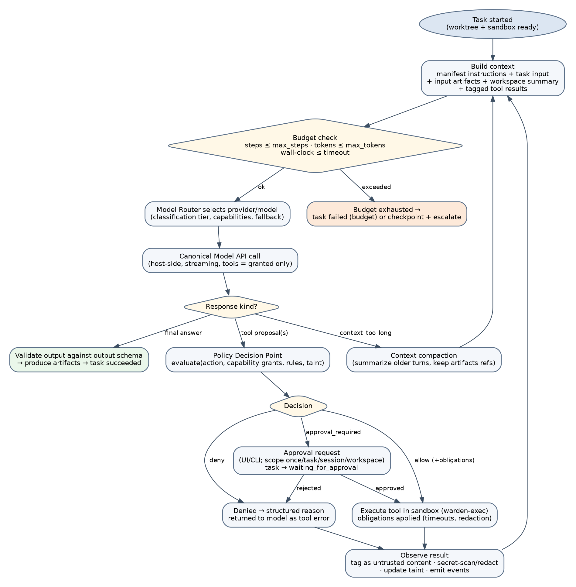

1. **Build context**: manifest instructions, task input, summaries of input artifacts, a workspace map, previous tool results (tagged with provenance), all secret-scanned and redacted.
2. **Check budgets**: steps, tokens, wall clock, cost. Exhaustion produces a checkpoint artifact and `failed(budget)`, never a silent stop.
3. **Route**: the router picks `(provider, model)` for this task and records why.
4. **Call the model** from the runtime process, streaming, with tool definitions equal to the granted capabilities rendered in the provider's format. A model can only propose what the agent may request.
5. **Handle the response**: a final answer is validated against the output schema and turned into artifacts; each tool proposal goes to the Policy Decision Point; `context_too_long` triggers compaction (older turns summarized, artifacts referenced by id).
6. **Decide**: `allow` (with obligations), `approval_required` (task waits; the user sees what, who, why, and picks a scope), or `deny` (a structured reason is returned to the model as a tool error so it can adapt).
7. **Execute** in the sandbox through `warden-exec` with obligations applied (timeouts, output caps, redaction).
8. **Observe**: results are wrapped as data, marked untrusted, secret-scanned; reading untrusted-external content sets the task's taint; events are emitted; loop.

# 14. Model integration and routing

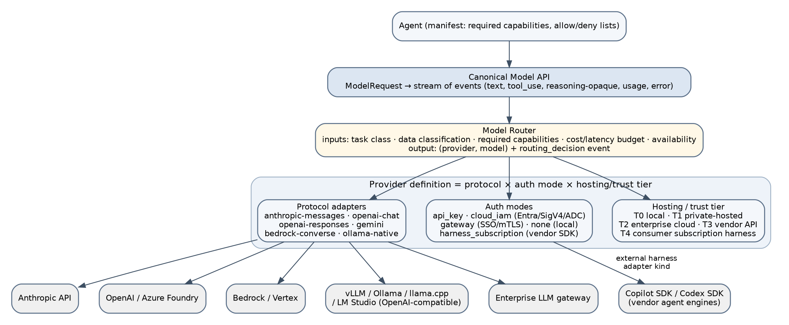

## 14.1 Canonical model interface

One request shape: messages with typed content blocks (`text`, `image`, `document`, `tool_use`, `tool_result`, opaque `reasoning`), tool definitions, `tool_choice`, `response_format` with JSON Schema, generation parameters, cache hints, budgets, trace identifiers, and `provider_options.<protocol>` as a controlled escape hatch. One streamed event vocabulary: `message_start`, `text_delta`, `reasoning_delta`, `tool_use_start/delta/end`, `usage`, `message_end`, `error`. Normalized errors: `rate_limited`, `auth_failed`, `context_too_long`, `provider_unavailable`, `content_filtered`, `invalid_request`, `tool_format_unsupported`, `model_not_found`, `timeout`, `cancelled`. Every call produces `model.call.start` and `model.call.end` events with usage and latency. Full contract in WRD-05.

## 14.2 Provider categories, re-modeled on three axes (P-07)

| Axis | Values |
|---|---|
| Protocol | `anthropic-messages`, `openai-chat`, `openai-responses`, `gemini`, `bedrock-converse`, `ollama-native`; `openai-compatible` is `openai-chat` with feature probing |
| Auth mode | `api_key`; `cloud_iam` (Entra ID, AWS SigV4, GCP ADC); `gateway` (bearer, mTLS, SSO/OIDC); `none` (local); `harness_subscription` |
| Hosting / trust tier | T0 local (loopback); T1 private-hosted (organization network); T2 enterprise cloud (Azure OpenAI/Foundry, Bedrock, Vertex AI); T3 vendor API; T4 consumer subscription harness |

Everything the drafts listed is covered: direct frontier APIs (T3, api_key), Azure OpenAI, Bedrock and Vertex (T2, cloud_iam), OpenAI-compatible endpoints, vLLM, Ollama, llama.cpp, LM Studio (T0/T1, none or gateway), internal gateways (T1/T2, gateway), specialized security, coding, embedding and classification models (catalog entries with capability flags).

## 14.3 Every access mode, including subscriptions

| Mode | Examples | Billing | Trust tier |
|---|---|---|---|
| API key | Anthropic, OpenAI, Gemini API, Mistral, any OpenAI-compatible SaaS | Per token | T3 |
| Cloud identity | Azure OpenAI / Foundry, Bedrock, Vertex AI | Cloud account | T2 |
| Enterprise gateway | LiteLLM, Portkey, internal gateway with SSO or mTLS | Organization-internal | T1/T2 |
| None (local) | Ollama, vLLM, llama.cpp server, LM Studio | Infrastructure only | T0/T1 |
| Vendor harness (subscription) | GitHub Copilot SDK, OpenAI Codex SDK, Claude Code headless | Vendor subscription quota or the vendor's API key | T4 |

> Vendor terms as of September 2026: Anthropic prohibits consumer-subscription OAuth tokens in any third-party product, including its own Agent SDK (enforced since early 2026; API keys, "extra usage", Bedrock, Vertex and Microsoft Foundry are the supported paths; running the official Claude Code CLI yourself is ordinary use). Google restricted Gemini CLI similarly in February 2026 (the Gemini API with an API key is unaffected). OpenAI tolerates Codex OAuth with a ChatGPT plan in third-party tools without an explicit guarantee. GitHub's Copilot SDK is generally available since June 2026, explicitly meant for embedding, billed as premium requests, with BYOK for enterprises. The platform therefore ships no token-replay or proxy-spoofing paths and records `vendor_terms: permitted | tolerated | prohibited` per harness.

The API-key and cloud-identity paths are the core and are mandatory. Harnesses are add-ons whose main value is "bring the subscription you already pay for", which matters most for individuals and small teams (D-26).

## 14.4 External harness adapters

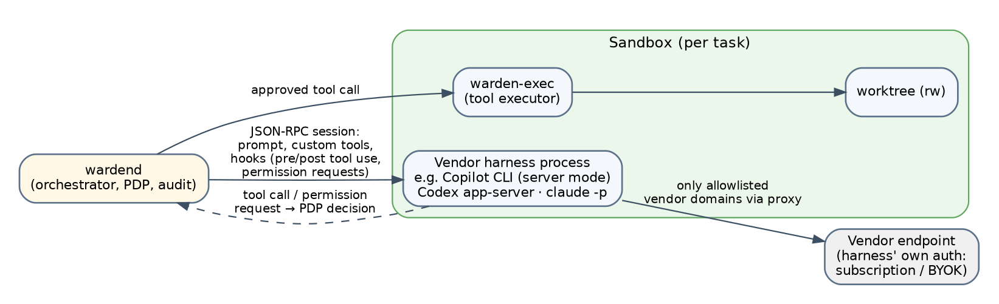

| Harness | Integration | Billing modes shipped | Terms | Phase |
|---|---|---|---|---|
| GitHub Copilot SDK | Copilot CLI in server mode inside the sandbox; JSON-RPC session; built-in tools overridden by runtime tools; pre/post tool-use and permission hooks routed to the policy engine | Copilot subscription (premium requests) or BYOK | Permitted | MVP (optional install) |
| OpenAI Codex SDK / app-server | Codex app-server inside the sandbox; approval callbacks routed to the policy engine | ChatGPT plan login (opt-in with notice) or API key | Tolerated | Phase 2 |
| Claude Code headless (`claude -p`) | Claude Code CLI inside the sandbox | API key only | Consumer OAuth prohibited; API key permitted | Phase 2 |

A harness task is a normal task with a manifest, limits and artifacts; its network is restricted to the vendor's endpoints; its configuration directory is mounted read-only; it runs at L2 by default; its output is tainted; where the engine lacks hooks, policy may forbid it for `confidential` and `restricted` workspaces.

## 14.5 Provider-specific capabilities (D-04)

Catalog flags per model: `tool_calling: native | emulated | none`, `structured_output`, `streaming`, `vision`, `reasoning`, `prompt_caching`, `max_context`, `max_output`, plus prices. Missing capabilities are emulated where possible (prompt-based tool protocol, post-validation with one repair turn, aggressive compaction) or exclude the model from tasks that require them. The MVP requires `tool_calling` and `streaming` for all built-in agents.

## 14.6 Model routing

Routing considers task class, data classification, required capabilities, agent allow and deny lists, strategy (quality-first, cost-first, latency-first, prefer-internal), budgets, provider health and evaluation-derived quality priors. The routing decision is an auditable event listing every candidate and why it was chosen or rejected.

| Classification | Allowed tiers by default |
|---|---|
| restricted | T0, T1 |
| confidential (default for repositories) | T0, T1, T2; T3 only with a recorded data agreement |
| internal | T0 to T3 |
| public | T0 to T4 (T4 only for permitted harnesses) |

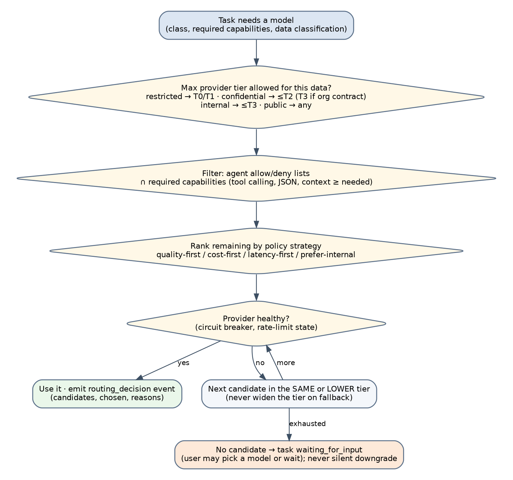

Worked examples kept from the drafts, now resolved by the matrix: a security review of confidential code with "external models prohibited" routes to an internal model (T0/T1); an architecture analysis of a public repository with a high budget routes quality-first to a frontier model; a documentation rewrite of public content with a low budget routes cost-first to a cheap or local model. Full specification in WRD-06.

# 15. Tool and capability system

Tools are first-class objects. An agent receives scoped capabilities instead of host access.

| Element | Content |
|---|---|
| Initial tool classes (all phases) | Filesystem, process execution, git, browser, cloud APIs, Kubernetes, databases, Jira and GitHub Issues, Slack and Teams, MCP servers, internal enterprise APIs |
| MVP tools | `fs.read/list/search/write/patch`, `proc.exec`, `git.status/diff/log/commit`, `test.run`; `git.push` as a host tool with mandatory approval; `orchestrator.delegate`; `approval.request` |
| Capability definition | Tool, operations, resource scope (paths, commands, hosts, servers), allowed and denied paths, allowed commands and profiles, egress allowlist, environment allowlist, rate limits, timeouts, approval requirements |
| Risk classes | R0 read in workspace; R1 write in worktree; R2 profile command; R3 other command; R4 non-allowlisted egress; R5 host effect; R6 forbidden |
| Executor | `warden-exec` inside the sandbox over JSON-RPC; a second line of defense, not the decision point |
| Results | Wrapped as untrusted data with provenance; secret-scanned; taint set by external content |
| MCP (Phase 2) | Stdio servers inside the sandbox; per-server trust; per-tool grants; descriptions hashed and re-approved on change; outputs untrusted |

Example capability, corrected from the drafts (paths rooted in variables, profiles instead of raw commands, egress explicit):

```
capabilities:
  - tool: fs
    operations: [read, write]
    paths:
      allow: ["${worktree}/src/**", "${worktree}/tests/**"]
      deny:  ["${worktree}/.github/**"]
  - tool: proc
    operations: [exec]
    commands: { allow: ["npm", "pnpm", "go", "git"], profiles: [node-test, go-test] }
    timeout_seconds: 300
    egress: { allow: ["registry.npmjs.org:443", "proxy.golang.org:443"] }
```

Every tool invocation passes the runtime's policy decision point. Connecting an MCP server never grants unrestricted authority. Full specification in WRD-04.

# 16. Policy engine

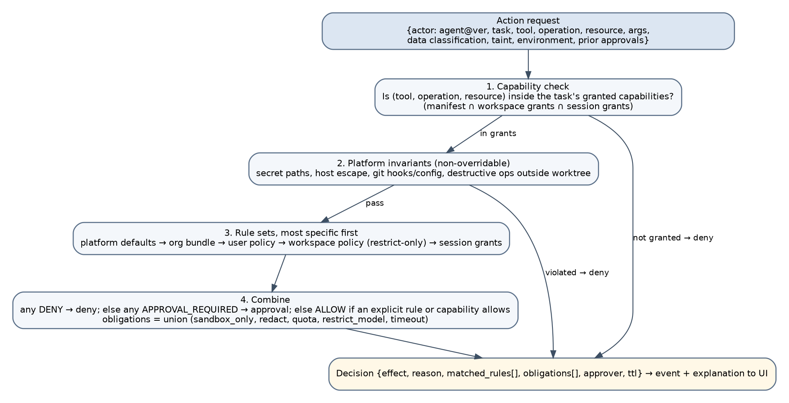

| Element | Content |
|---|---|
| Effects (corrected, P-06) | `allow`, `deny`, `approval_required`. The drafts' `restricted_allow`, `sandbox_only`, `redact_then_allow`, `allow_with_quota` are **obligations** on an allow; `defer` belongs to the scheduler; `retry_with_fallback` belongs to the router |
| Obligations | `sandbox_level`, `timeout_seconds`, `max_output_bytes`, `redact_output`, `restrict_models`, `quota`, `log_full_args` |
| Inputs | User, agent identity and version, workflow and task, tool and operation, resource scope, data classification, model and provider, environment, repository, branch, time, risk class, taint, previous approvals, quotas |
| Layers | L0 platform invariants (non-overridable) → L1 platform defaults → L2 organization bundle → L3 user policy → L4 workspace policy (restrict-only) → L5 session grants |
| Combination | Explicit deny wins; then approval required unless a valid grant covers the action; else allow; obligations are unioned, most restrictive value wins |
| Approval scopes | `once`, `task`, `session`, `workspace`; R5 actions are never persistable beyond `once` |
| Explainability | `policy.explain` returns the decision that would be made with matched rules; the UI shows a plain-language reason |
| Non-interactive mode | `approval_required` becomes `deny` unless a pre-approval exists in the bundle |
| Syntax | YAML rule sets with CEL conditions (D-15) |

Example decision, in the corrected shape:

```
{ "effect": "approval_required",
  "reason": "Command is outside the approved profiles (node-test, build, lint).",
  "matched_rules": ["user.other-commands"],
  "obligations": { "timeout_seconds": 600, "max_output_bytes": 262144 },
  "approval": { "approvers": ["session-owner"], "scope_max": "task", "ttl_seconds": 3600 } }
```

Full specification in WRD-08.

# 17. Security architecture

Security is a product layer and does not depend on the implementation language. The platform supports identity and authentication, role-based access control, agent-level and tool-level permissions, filesystem isolation, process isolation, network egress controls, secrets management, credential brokering, data classification, model allow and deny policies, human approval gates, sandboxing, audit logging, tamper-evident event records, agent package signing, dependency and supply-chain controls, rate limits, resource quotas, execution timeouts, kill and cancellation controls, and environment separation.

**Security invariant.** The model can propose an action. The agent can request an action. The runtime decides whether the action is permitted.

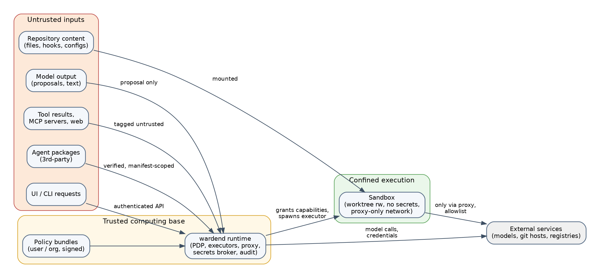

| Boundary | Control |
|---|---|
| User ↔ client | OS user session; the client shows what will be done before it is done |
| Client ↔ runtime | Owner-only socket, per-session token; privileged methods need interactive confirmation |
| Runtime ↔ agent package | Digest-pinned packages; manifest caps capabilities; signature verification |
| Runtime ↔ tool executor | Capability grants become concrete mounts, namespaces, seccomp or Seatbelt profiles, limits |
| Runtime ↔ model provider | Host-side TLS; credentials from the broker; data classification enforced by the router |
| Runtime ↔ secrets broker | References only; values in the OS keychain; every access is an event |
| Sandbox ↔ network | Proxy only; per-task allowlist; credential injection host-side |
| Local ↔ remote execution | mTLS worker identity; signed bundles; chain-verified event sync |
| Control plane ↔ execution plane | Signed policy and registry bundles with TTL; defined offline behavior |

## 17.1 The sandbox contract (D-05)

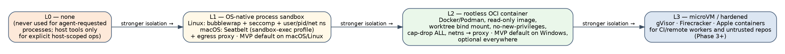

| Property | Requirement |
|---|---|
| Filesystem | Worktree read-write; toolchain read-only; private `/tmp`; no home directory, no `~/.ssh`, `~/.aws`, `~/.config/gcloud`, `~/.npmrc`, `~/.docker`, keychain sockets or browser profiles |
| Process | No new privileges; capabilities dropped; no ptrace; PID namespace on Linux; CPU, memory, pids and disk quotas; wall-clock timeout with kill |
| Network | No interfaces except loopback in a private namespace; the only exit is the proxy socket; DNS through the proxy |
| Environment | Minimal, explicit; `HOME` set to a scratch directory |
| Git | Global and system config disabled; hooks path pointing to an empty directory; `.git` of the main repository not mounted |
| Executor | `warden-exec` is the only launched process; everything else is its child |

Linux L1: bubblewrap with all namespaces unshared, seccomp filter, Landlock where available, cgroup limits. macOS L1: Seatbelt profiles generated per task. L2 everywhere: rootless OCI container (Docker or Podman), read-only image, `cap-drop ALL`, `no-new-privileges`, `network none` plus the proxy socket; default on Windows (WSL2 backend) and for untrusted repositories; harness tasks default to L2. L3 (Phase 3): gVisor, Firecracker, Apple containers for workers and CI.

## 17.2 Secrets and egress (D-08, D-09)

Secrets live in the OS keychain and are referenced as `secret://…`; the broker injects them into provider adapters and the proxy on the host; they never enter a sandbox as environment, arguments or files. A platform deny-list of secret paths (`.env*`, key files, cloud and package-manager credential files, `~/.ssh`, `~/.aws`, and more; WRD-10 §6) is enforced at three layers: policy, executor and mount. A secret scanner redacts tool outputs, artifacts and context before persistence or model calls. The sandbox's only network path is a per-task proxy with a deny-by-default allowlist and host-side credential injection for allowlisted services (git hosts, private registries); model traffic never traverses the sandbox proxy.

## 17.3 Initial threat model (D-22)

The drafts' list is kept in full and extended: prompt injection, malicious repositories, malicious dependencies, secret discovery, data exfiltration, unsafe shell commands, unauthorized network access, compromised MCP servers, malicious agent packages, provider data leakage, policy bypass, tool impersonation, workspace escape, cross-session data leakage, uncontrolled autonomous execution; plus harness credential theft, workspace policy widening, audit tampering, secret leakage into logs, runtime supply chain, insecure fallback, approval fatigue. WRD-10 maps 24 threats to mitigations and tests and defines the sandbox escape test suite that runs in CI on each operating system.

## 17.4 Prompt-injection defenses (P-19)

Instructions come only from manifests and the user; every observation is wrapped as data with provenance and marked untrusted; reading external content (web, MCP, third-party packages, harness output) sets a taint that escalates host-effecting actions to approval regardless of session grants; analysis and review agents are read-only by manifest; the UI shows every tool call and its arguments; security evaluation cases test that injected instructions do not lead to out-of-scope actions.

# 18. Context and memory

Context sources: user request, repository files, task artifacts, previous agent results, enterprise knowledge (later), tool results, workflow state, policy metadata, evaluation requirements.

```
Context sources → selection and classification → redaction (secret scanning) → context policy → agent context → model
```

| Layer | Content | Lifetime |
|---|---|---|
| Request context | User request, repository summary | Task |
| Task context | Inputs, artifact summaries, tagged tool results | Task |
| Session context | Compacted transcript, plan, decisions | Session |
| Workspace knowledge (Phase 2) | Conventions, architecture notes from the explorer | Workspace |
| Enterprise knowledge (Phase 4) | Retrieval over approved sources with classification | Organization |

Sensitive data restricted from particular models is enforced by classification and routing, not by prompt wording. Context provenance is recorded (`context.assembled` events). No durable cross-session memory in the MVP.

# 19. Workflow and orchestration

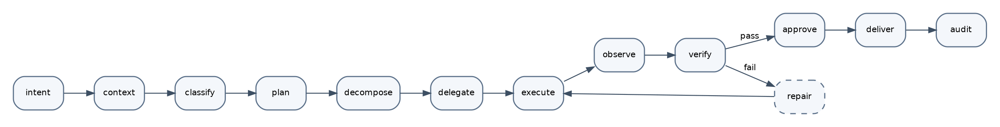

Workflows are dependency graphs, not fixed agent swarms. Independent tasks run concurrently when they have no unresolved dependencies, their workspaces are isolated, resource policy allows it, and their combined cost and risk are acceptable.

## 19.1 The MVP coding workflow as a DAG

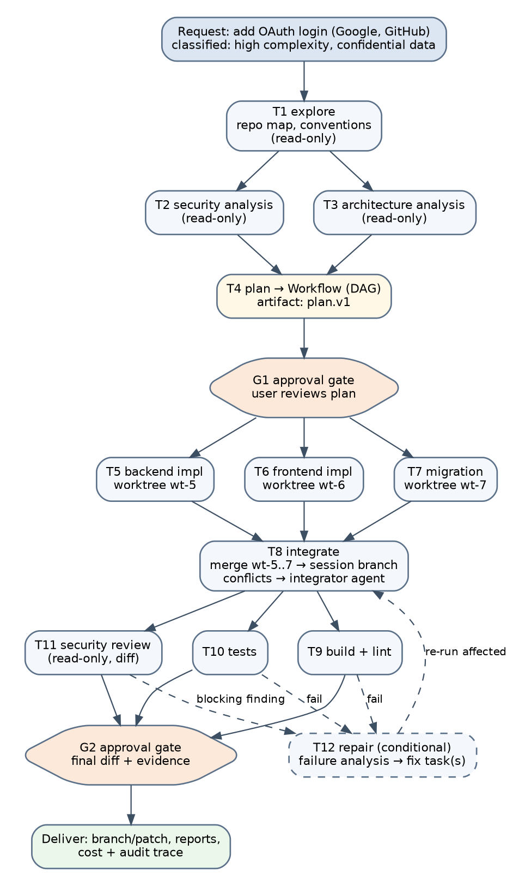

The drafts' feature-request DAG (research, security and UX analysis → plan → backend, frontend, database → integrate → tests and security → review) is realized by a fixed template: explore → security and architecture analysis (read-only, advisory) → plan → approval gate G1 → implementation in up to three parallel worktrees → integrate → build, test, security review → conditional repair rounds → approval gate G2 → deliver. The planner fills the implementation slot with one to three tasks with disjoint path sets and a rationale each.

## 19.2 Task state model (formalized, P-12)

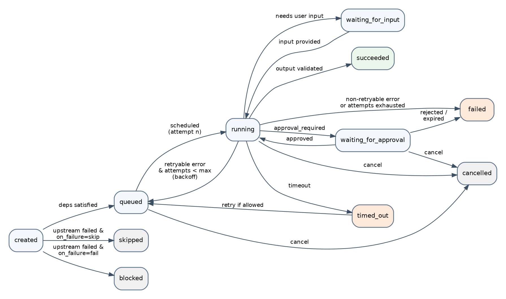

States: `created`, `queued`, `running`, `waiting_for_input`, `waiting_for_approval`, `succeeded`, `failed`, `cancelled`, `timed_out`, `skipped`, `blocked`. Retrying is an attempt counter on a re-queued task, not a state. Every transition carries a reason code.

## 19.3 Failure, retry and cancellation semantics (D-12, D-13)

Each task defines timeout, maximum attempts (default 2), retryable versus non-retryable errors, backoff (exponential with jitter), idempotency behavior (checkpoint commits on the task branch), cancellation behavior (cooperative cancel, SIGTERM then SIGKILL, partial artifacts kept), escalation (`waiting_for_input`), and compensation (worktree preserved, session branch untouched until the final gate). A failed coding task is never retried identically after a verification failure: the runtime creates a repair task with a failure-analysis artifact and re-runs only the affected verification.

## 19.4 Agent communication and worktrees (P-10, P-14)

Agents exchange only typed artifacts through task inputs; parents receive children's output summaries, never transcripts. Each modifying task gets its own worktree on a task branch created from the session branch; the integrator merges task branches into the session branch and resolves conflicts within conflicted files, followed by re-verification; nothing touches the user's working tree until the final gate. Full specification in WRD-07.

# 20. Artifacts, provenance, observability and audit

| Artifact | Example |
|---|---|
| Plan | Implementation plan and dependency graph |
| Research report / repo map | Architecture findings, conventions, build and test commands |
| Code diff / integrated diff | Git patch or worktree state with base and head commits |
| Test report / build report | Passed and failed tests, durations |
| Security report | Findings with severity, confidence, evidence, remediation, blocking flag |
| Design specification | UX and component requirements (family B) |
| Approval record | Who approved what, when, with which scope |
| Execution trace | Agent, tool, model and policy events for a task |
| Cost report | Tokens, quota units, estimated cost per task and model |
| Final result | Summary, changed files, verification evidence, chain checkpoint |

Each artifact records provenance: session, workflow, task, execution, agent name, version and digest, runtime version, model and provider with tier, routing decision, input artifacts, tool calls, policy decisions, approvals, worktree and commits, timestamps. Purpose: auditing, incident response, evaluation, debugging, billing, reproducibility, compliance, trust.

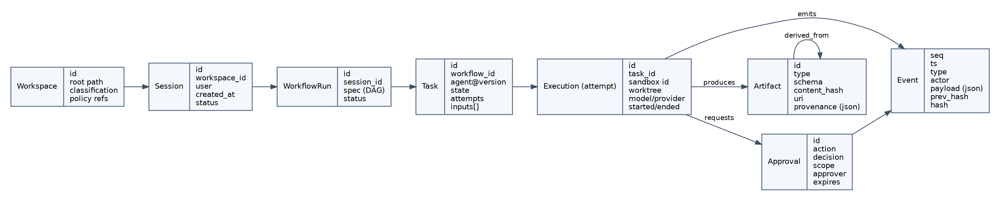

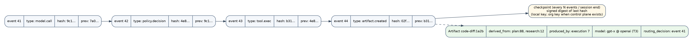

The platform answers the governance questions of the drafts: which user initiated the work; which agent and version ran; which model and provider were used and why; which tools were called and which permissions exercised; what data was accessed; which policies applied; which actions were approved or denied; how long it took; how many tokens; what it cost; which tasks failed; which artifacts were produced; which verification stages passed; which model performed best; how often a human intervened. The MVP stores events and artifacts in SQLite under the user profile with a hash chain and signed checkpoints; the enterprise version adds central collection, retention policies, tenant isolation, compliance exports, searchable history, cost analytics and dashboards. Full schema in WRD-09.

# 21. Initial coding workflow (worked example)

Example request: "Add OAuth authentication with Google and GitHub, update the UI, add tests, and verify the security model."

1. Receive the request; classify complexity, risk and data sensitivity (here: high complexity, confidential repository).
2. Explore the repository (read-only): languages, build and test commands, conventions; produce `repo-map`.
3. Run security and architecture analysis (read-only, advisory); produce `security-notes`.
4. Plan: the planner produces the `plan` artifact with one to three implementation tasks (backend OAuth abstraction with Google and GitHub handlers; login UI and session handling; optional migration), expected files, risks, estimated cost and a rationale for the split.
5. Gate G1: the user approves, edits or cancels the plan.
6. Implement: each task runs in its own worktree and sandbox; approval prompts appear for commands outside profiles or new egress; each task produces a `code-diff`.
7. Integrate: task branches merge into the session branch; conflicts go to the integrator.
8. Verify: build, tests, static analysis and a read-only security review of the integrated diff.
9. Repair: failures produce a `failure-analysis` and fix tasks; affected verification re-runs (at most two rounds).
10. Gate G2: the user reviews the diff, reports, cost and audit trace and applies, commits, pushes (approval) or iterates.
11. Deliver: final diff, reports, usage and cost data, audit trace with a signed checkpoint.

# 22. MVP definition

**Objective.** Prove that a developer can request a bounded repository change and receive a verified, reviewable result through a secure, model-neutral runtime, with a complete audit trail, using the model access they already have.

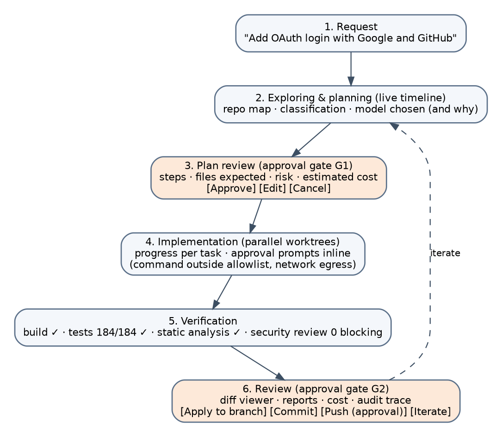

| Area | MVP capabilities |
|---|---|
| Experience | Desktop workspace, conversational request interface, execution timeline, plan view, approval prompts, artifact viewer, diff viewer, verification summary; CLI parity |
| Runtime | Sessions, task execution, persistence, cancellation, timeouts, structured events, local artifacts |
| Tools | Filesystem read and write, process execution, git status, diff, log, commit, worktrees, build and test commands |
| Models | Anthropic Messages, OpenAI Chat and Responses, OpenAI-compatible (Ollama, vLLM, llama.cpp, LM Studio, gateways, Gemini API through its OpenAI-compatible endpoint); canonical API; routing with tiers; fallback; usage tracking; optional Copilot SDK harness |
| Agents | Explorer, planner, coder, verifier, security reviewer (read-only), integrator, repairer; local manifests and versions |
| Security | Workspace path restrictions, command profiles and allowlists, egress proxy, approval gates, secret-file protection, sandbox L1 (macOS, Linux) and L2 (all, Windows), worktree isolation, hash-chained audit events |
| Verification | Build, unit and integration tests, static analysis, security review, changed-file summary |
| Telemetry | Tokens, quota units, model and provider, task duration, tool calls, policy decisions, estimated cost |
| Evaluation | `warden eval run` with the first suite (10 coding and 6 security cases) |

**Non-goals for the MVP.** Public agent marketplace; dozens of providers; multi-region control plane; autonomous production deployment; general-purpose long-term memory; custom model training; unrestricted third-party MCP execution (MCP client is Phase 2); enterprise SSO and fleet management; every enterprise integration.

**Acceptance criteria** (full list in WRD-01 §6): primary journey completes on the TypeScript fixture in under 20 minutes on each OS; evaluation thresholds met (coding ≥ 70% with a frontier model, ≥ 40% with a 30B-class local model, security cases 100%); sandbox escape suite passes; every tool call has a preceding decision event and the audit chain verifies; the same request completes on Anthropic, OpenAI and a local server without manifest changes; cancellation terminates all processes within 5 seconds; cost figures match provider usage reports within 2%.

# 23. Desktop and runtime architecture (D-06)

```
Desktop UI (React + TypeScript)  ──┐
CLI (warden, Go)                  ──┤── JSON-RPC 2.0 over local socket ──► wardend (Go daemon)
CI (warden --non-interactive)     ──┘                                        ├── session manager
                                                                             ├── orchestrator and scheduler
Desktop shell: Tauri 2 (daemon as sidecar)                                   ├── agent loop and context manager
                                                                             ├── policy decision point
                                                                             ├── model router and provider adapters
                                                                             ├── harness adapters
                                                                             ├── secrets broker and egress proxy
                                                                             ├── sandbox and worktree managers
                                                                             ├── event and artifact store (SQLite)
                                                                             └── telemetry
                                                                                   │
                                                                     warden-exec inside the sandbox (per task)
```

Constraints (all enforced by an import lint in the repository): the UI contains no agent logic; agents import no provider SDKs; providers cannot bypass the runtime; tools cannot execute without policy evaluation; the runtime is never linked into the desktop process. Technology: Go for `wardend`, `warden` and `warden-exec` (single static binaries, first-class process and network control, mature keychain and IPC libraries); Tauri 2 with React and TypeScript for the desktop (strong security model, sidecar support, small footprint); SQLite in WAL mode; CEL for policy conditions; JSON-RPC 2.0 for IPC (the same choice as language servers, the Copilot SDK and the Codex app-server). No implementation language is treated as a security mechanism.

# 24. Agent registry and SDK

Registry contents: built-in, company, team and third-party agents; versions; permissions; model requirements; runtime compatibility; approval status; deployment targets; evaluation results; package signatures. MVP: a local registry under `~/.warden/agents` addressed by digest. Enterprise: agent packages as OCI artifacts in the organization's existing registry, signed with sigstore or Ed25519 keys (D-32).

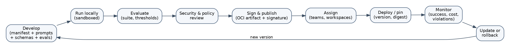

SDK responsibilities (Phase 4): agent definition, tool registration, input and output schemas, model requirements, policy requirements, lifecycle hooks, artifact contracts, evaluation tests, deployment metadata, structured logging, cancellation handling. Coded agents run **inside the sandbox** and reach models and tools only through the Agent Protocol (JSON-RPC over stdio: `runtime.model.generate`, `runtime.tool.call`, `runtime.artifact.*`, `runtime.ask`, `runtime.delegate`); the runtime remains the decision point (P-22). External harness adapters are implemented as built-in coded agents using the same protocol. SDKs in TypeScript, Go and Python. Full specification in WRD-14.

# 25. Evaluation framework

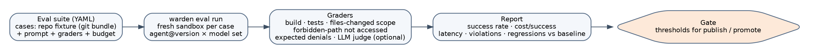

Evaluations measure task success rate, regression rate, tool-use correctness, policy violations, human intervention rate, latency, cost per successful task, provider reliability, failure recovery rate, reproducibility, scope compliance and artifact quality. For the coding workflow they verify that the requested behavior was implemented, the project builds, relevant tests pass (including hidden tests), only intended files changed, sensitive paths were not accessed, disallowed commands were blocked, the result includes verification evidence and the expected artifacts exist. Suites are YAML with git-bundle fixtures (TypeScript, Go, Python and an injection lab); graders are deterministic with an optional rubric judge; gates apply to every built-in agent release and to runtime releases; results feed the router's quality priors. First 16 cases in WRD-12 §7.

# 26. Deployment models

| Deployment model | Use case | Phase |
|---|---|---|
| Desktop / local | Individual developer workflows | MVP |
| Desktop plus control plane | Managed developer environments | 3 |
| Private cloud | Sensitive enterprise workloads | 3 |
| On-premises | Regulated or restricted environments | 3 |
| CI/CD worker | Headless automated execution | 2 |
| Remote worker | Server-side scalable execution | 4 |
| Hybrid | Local UI with enterprise execution | 4 |

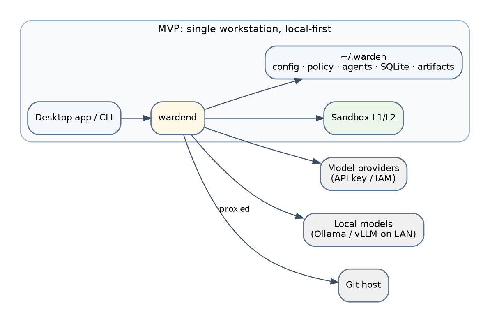

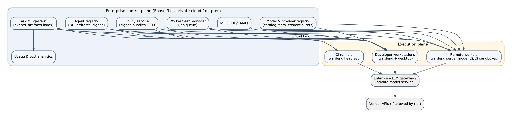

Operating systems (D-28): macOS 14+ and Linux (Ubuntu 22.04+, Fedora 39+, Debian 12+) first with the native L1 sandbox; Windows 11 with the L2 container backend (Docker Desktop, Podman Desktop or WSL2). Installation, configuration, provider setup, operations, updates, backup and troubleshooting are in WRD-13.

# 27. Enterprise control plane

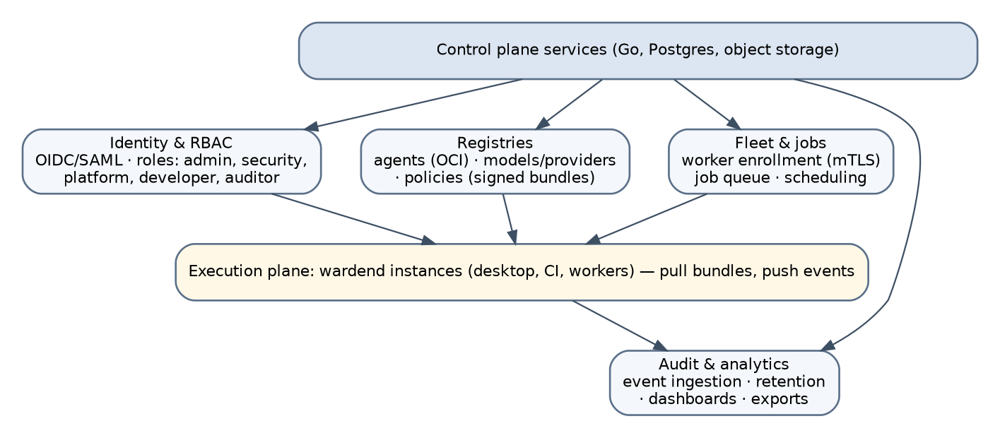

Services: identity and SSO (OIDC/SAML), RBAC (org-admin, security-admin, platform-admin, agent-author, developer, auditor), agent registry (OCI, signed, lifecycle from submitted to published or revoked), model and provider registry (catalog with tiers, prices, data agreements, credential references), policy service (signed bundles with TTL and grace period), deployment management, audit and compliance (chain-verified ingestion, retention, SIEM export), usage and cost analytics, evaluation management, worker fleet management (mTLS enrollment, job queue, classification-aware scheduling). Execution may occur locally, in a private cloud, on-premises, in managed workers or in CI.

Offline behavior (D-23): bundles cached within TTL work normally; within the grace period a warning is shown; beyond it only local (T0) models and read-only tools run and approvals are limited to `once`; an invalid bundle signature refuses enterprise workspaces; queued events sync in order. Full specification in WRD-15.

# 28. Technical repository structure

```
warden/
  cmd/wardend  cmd/warden  cmd/warden-exec
  internal/
    api  session  orchestrator  agentloop  policy  router  model
    providers/{anthropic,openai,openaicompat,gemini,bedrock,vertex}
    harness/{copilot,codex,claudecode}
    tools  sandbox/{linux_bwrap,darwin_seatbelt,oci}  proxy  secrets  worktree  store  evals
  agents/        built-in packages: explorer, planner, coder, verifier, security-reviewer, integrator, repairer
  schemas/       manifest, workflow, events, artifacts, runtime API, policy (JSON Schema)
  apps/desktop/  Tauri 2 + React
  docs/          this documentation set
```

Stable constraints: the UI does not contain agent logic; agents do not contain provider-specific integrations; providers do not bypass runtime policy; tools cannot execute without authorization; artifacts and events use stable schemas; local and remote execution share the same contracts; every execution has an identifiable owner, session, task and policy context.

# 29. Business model and licensing (D-29, D-30)

The company sells to businesses first; individuals are the on-ramp. The boundary rule that keeps the split clean: **one person on one machine is free and open; many people or many machines is commercial.**

| Edition | Contents | License | Price shape (indicative, to validate) |
|---|---|---|---|
| Community | Full runtime, desktop, CLI, all adapters and harnesses, sandbox L1/L2, local policy, local audit, evaluation runner, SDK | Apache 2.0 | Free. The B2C product and the bottom-up entry into companies |
| Team | Shared policy bundles, shared agent registry, team audit and cost analytics, CI pre-approvals; hosted or self-hosted control plane lite | Source-available (BSL 1.1 or Elastic License 2.0); customers may read and self-host under contract | Per seat per month, roughly €20 to €30 |
| Enterprise | SSO/SAML, RBAC, private or on-premises control plane, signed policies, worker fleet, central tamper-evident audit, SIEM and compliance exports, support with SLA, security audit reports | Source-available | Per seat (roughly €40 to €60) plus an annual platform fee with a minimum commitment |
| Add-ons | Remote worker and CI capacity; professional services (onboarding, custom adapters and integrations, agent development) | | Per worker node or per execution hour; day rates |

Fixed rules: model cost is always pass-through (customers bring their own keys and subscriptions; tokens are never marked up), which is the cleanest proof of neutrality; the core carries a contributor license agreement and the name is trademarked, so the open code stays open while the brand and the relicensing option stay with the company. Revenue streams from the drafts remain valid: enterprise licensing, private and on-premises deployment, support and SLAs, professional services, custom integrations, governance and compliance modules, managed control plane, usage-based remote execution, evaluation and optimization services. A paid individual tier is not built before the Team tier exists.

# 30. Defensibility

Multi-model support alone is not a moat. Defensibility comes from the combination of portable agent definitions and the Agent Protocol becoming a standard (possible only because the core is open), the trusted execution runtime and sandbox, capability-based security, enterprise policy enforcement, the agent registry, workflow orchestration, deep enterprise integrations, evaluation and benchmark history, cost and reliability intelligence, private deployment, installed-base workflow adoption and organization-wide governance. The strategic end state: all organizational AI agents execute through the approved runtime; developers use approved agents from the registry; security teams see and control what agents do; platform teams connect agents to approved models. At that point the platform is infrastructure.

# 31. Risks and mitigations

| Risk | Why it matters | Mitigation |
|---|---|---|
| Platform incumbents | Large vendors can build parts of the platform | Neutral execution, deployment, policy, portability, open core |
| Weak internal models | Internal models may not match frontier quality | Heterogeneous routing, task-specific selection, quality priors from evaluations |
| Self-hosting costs | Infrastructure may exceed API savings | Measure cost per successful task |
| Security liability | The runtime is a high-value attack surface | Isolation, policy, audit, supply chain; external audit before pilots |
| Multi-agent overhead | More agents increase cost and failure | Complexity-based delegation, DAGs, budgets |
| Integration complexity | Enterprise systems vary | Stable abstractions, few high-value integrations first |
| Poor agent quality | Customers create unsafe or ineffective agents | Manifests, templates, evaluations, governance |
| UX complexity | Orchestration can overwhelm users | One timeline, two gates, scoped approvals |
| Workspace conflicts | Parallel agents modify overlapping resources | Disjoint path sets, worktrees, integrator |
| Vendor dependency | Neutral platforms still depend on providers | Multiple providers and private endpoints |
| Prompt injection | Repository content and tools carry malicious instructions | Untrusted tagging, taint, approvals, evaluations |
| Policy bypass | A component circumvents authorization | Centralized decision point; invariants; tests |
| Data leakage | Sensitive data sent to an inappropriate model | Classification and tier admission; tier-bounded fallback |
| Offline inconsistency | Local execution uses outdated policies | TTL, grace period, degraded mode |
| Vendor terms drift (new) | Subscription paths can be revoked | API-key and cloud-identity paths primary; harnesses optional |
| Sandbox escape (new) | A single escape destroys trust | Defense in depth; L2 for untrusted repositories; escape test suite in CI; external penetration test |

# 32. Product success metrics

Primary: time and cost to produce a verified, reviewable software change. Secondary: percentage of tasks completed successfully and without manual intervention; cost per successful task; agent success rate; test and verification pass rate; policy violations prevented; mean time to diagnose failures; model-routing efficiency; developer adoption; approved agents deployed; internal versus external model usage; human approval frequency; workflow recovery rate; percentage of executions with complete provenance (target 100%).

# 33. Roadmap

| Phase | Goal | Key capabilities | Milestone that proves it |
|---|---|---|---|
| 0 | Validate the thesis | Customer interviews, runtime prototype, first providers | Agent loop plus fs/proc/git tools plus L1 sandbox plus two providers running; ten interviews done |
| 1 | Developer MVP | Desktop, coding workflow, tools, models, worktrees, verification, Copilot harness | WRD-01 acceptance criteria pass; security tests green |
| 2 | Multi-agent runtime | Dynamic DAG planning, MCP client, Gemini and cloud-identity adapters, Codex and Claude Code harnesses, CI mode, evaluations gating releases | Dynamic plans pass the suite; MCP servers governed per tool |
| 3 | Enterprise pilot | Control plane with SSO and RBAC, signed policies and registries, central audit, cost analytics, external security audit | First paying Team and Enterprise customers |
| 4 | Platform | SDK and Agent Protocol, remote workers, enterprise integrations | Third-party coded agents in a customer registry |
| 5 | Infrastructure | Ecosystem, third-party agents, advanced governance, fleet management | Organization-wide runtime adoption at reference customers |

# Part III. Decision log

# 34. Required decisions, resolved

Status legend: **Decided** (resolved, applied throughout the set), **Recommended (confirm)** (a concrete proposal exists; owner confirmation requested), **Deferred** (owner postponed it; placeholders in use).

| ID | Question (drafts §34) | Decision | Status |
|---|---|---|---|
| D-01 | First Agent Manifest schema | `warden.dev/v1alpha1`, `kind: Agent`, fields per WRD-03, JSON Schema published | Decided |
| D-02 | YAML, JSON or both | Authored in YAML; canonical JSON (RFC 8785) for hashing and signing | Decided |
| D-03 | Canonical Model API | Message and content-block model with streamed events, normalized errors, `provider_options` escape hatch (WRD-05) | Decided |
| D-04 | Required provider-specific capabilities | Catalog flags (`tool_calling`, `structured_output`, `streaming`, `vision`, `reasoning`, `prompt_caching`, `max_context`, `max_output`); MVP requires tool calling and streaming; emulation where possible | Decided |
| D-05 | Default sandbox strategy | L1 native (bubblewrap + seccomp; Seatbelt) with egress proxy; L2 rootless container everywhere, default on Windows and for untrusted repositories and harnesses; L3 microVM later | Decided |
| D-06 | Runtime language and desktop shell | **Go** for `wardend`, `warden`, `warden-exec`; **Tauri 2 + React/TypeScript** for the desktop | Decided (owner, September 25, 2026) |
| D-07 | Tool and Capability API | Descriptors, risk classes, capability grammar, executor protocol (WRD-04) | Decided |
| D-08 | Default network policy | Sandbox deny-all; egress only through the runtime proxy with per-task allowlists; model calls host-side; package registries per workspace after first approval | Decided |
| D-09 | Secrets brokering | OS keychain with `secret://` references; host-side injection into adapters and proxy; never in the sandbox; platform deny-list; output redaction | Decided |
| D-10 | MCP trust and isolation | Phase 2: stdio servers inside the sandbox, per-server trust, per-tool grants, descriptions hashed and re-approved on change, remote servers through the proxy | Decided |
| D-11 | Workflow and DAG schema | `kind: Workflow` (WRD-07) for templates and plans alike | Decided |
| D-12 | Task retry semantics | Retryable transients with backoff, max 2 attempts; verification failure creates a repair task; policy denial not retried | Decided |
| D-13 | Cancellation semantics | Cooperative cancel propagated to children; SIGTERM then SIGKILL; partial artifacts kept; worktree preserved | Decided |
| D-14 | Event and artifact schema | Envelope, taxonomy, hash chain, signed checkpoints, content-addressed artifacts with provenance (WRD-09) | Decided |
| D-15 | Local policy syntax | YAML rule sets with CEL conditions; layered precedence; workspace layer restrict-only (WRD-08) | Decided |
| D-16 | Actions that always require approval | `git push`, protected-branch commits, writes or deletions outside the worktree, non-profile commands, non-allowlisted egress, secret access by name, first package installation per workspace, changes to hooks, git config or CI files, message and ticket tools, tolerated-terms harness sessions | Decided |
| D-17 | Data classifications | `public`, `internal`, `confidential` (default), `restricted`; per workspace with path overrides | Decided |
| D-18 | Which data may go to which model | Tier admission matrix (Part II §14.6), tightened by policy, never loosened by a workspace | Decided |
| D-19 | Provider unavailable | Retries with backoff, circuit breaker, fallback within the same or lower tier only, otherwise wait for input | Decided |
| D-20 | Local versus remote storage | MVP entirely under `~/.warden`; sync-ready contracts for Phase 3 | Decided |
| D-21 | First evaluation tasks | 10 coding cases on TypeScript, Go and Python fixtures plus 6 security cases (WRD-12) | Decided |
| D-22 | Initial threat model | STRIDE-based, 24 threats mapped to mitigations and tests (WRD-10) | Decided |
| D-23 | Offline execution | Cached bundles with TTL and grace; degraded mode afterwards; queued event sync | Decided |
| D-24 | First ten customer discovery questions | Proposed list in WRD-01 §10 | Recommended (confirm; adjust to target segment) |

# 35. Additional decisions raised by the review

| ID | Question | Decision | Status |
|---|---|---|---|
| D-25 | Product name | "Warden" remains the placeholder | Deferred (owner: not important now) |
| D-26 | Subscription-harness stance | Implement all three: Copilot SDK (subscription or BYOK, permitted, MVP optional), Codex SDK (ChatGPT plan opt-in with notice, or API key; tolerated; Phase 2), Claude Code headless (API key only; Phase 2). The API-key and cloud-identity provider paths are the mandatory core; harnesses are add-ons. No token replay or client spoofing, ever | Decided (owner, September 25, 2026) |
| D-27 | First providers | Anthropic Messages; OpenAI Chat and Responses; OpenAI-compatible (Ollama, vLLM, llama.cpp, LM Studio, LiteLLM and other gateways). Gemini is available on day one through the Gemini API's OpenAI-compatible endpoint with an API key (what is restricted is only the Gemini CLI consumer subscription); native Gemini, Vertex, Bedrock and Foundry adapters in Phase 2 | Decided (owner, September 25, 2026) |
| D-28 | Target operating systems | macOS and Linux first with L1; Windows with L2 | Decided (owner, September 25, 2026) |
| D-29 | Licensing model | Open-core per Part II §29: Community edition Apache 2.0; Team and Enterprise source-available; B2B focus with the free edition as the B2C on-ramp | Recommended (confirm) |
| D-30 | Unit of enterprise licensing | Per execution-plane seat; annual platform fee for Enterprise; per worker node or execution hour for headless capacity; model cost pass-through | Recommended (confirm) |
| D-31 | Runtime API transport | JSON-RPC 2.0 with LSP-style framing over a local socket; WebSocket with mTLS for remote workers later | Decided |
| D-32 | Agent package distribution format | OCI artifacts in any OCI registry, signed with sigstore or Ed25519 | Decided |

# 36. Final product definition

The product is an enterprise AI agent operating system and runtime.

```
        Agents        Workflows        Models        Tools
          │              │               │             │
          └──────────────┴───────┬───────┴─────────────┘
                                 │
                          Orchestration
                                 │
                           Agent Runtime
                                 │
                 ┌───────────────┼───────────────┐
              Security         Policy         Execution
                 └───────────────┼───────────────┘
                                 │
                   Enterprise AI Infrastructure
```

The initial coding assistant is the beachhead. The long-term product is the secure execution and governance layer through which an enterprise runs its AI agents. The defining promise: bring your own models, infrastructure, agents, tools and policies, and run them through one secure, observable, enterprise-ready runtime.

# Part IV. Appendices

# 37. Appendix A. Terminology

| Term | Definition |
|---|---|
| Agent | A role-specific autonomous or semi-autonomous worker with instructions, tools and permissions, packaged with a manifest |
| Agent Protocol | JSON-RPC contract between the runtime and an agent implementation or harness running in the sandbox |
| Agent registry | Catalog and lifecycle system for approved agents |
| Approval | Human or system authorization for a sensitive operation, with scope and expiry |
| Artifact | A structured, content-addressed output of an execution with provenance |
| Capability | A specific operation and resource scope granted by manifest and narrowed by policy |
| Control plane | Central management layer for identity, policy, registry, deployment and analytics |
| Data classification | `public`, `internal`, `confidential`, `restricted`, assigned per workspace and path |
| Evaluation | A repeatable test of an agent, workflow or model |
| Execution | One attempt of a task in one sandbox |
| Execution plane | The environment where agent work occurs |
| External harness | A vendor's agent engine executed inside the sandbox as a task backend, governed through hooks and the sandbox |
| Hash chain | Each event includes the hash of the previous event; checkpoints are signed |
| Model | An AI system used for reasoning, generation, classification, embedding or other inference |
| Model router | The policy-aware component that selects provider and model |
| Obligation | A constraint attached to an allow decision (sandbox level, redaction, quota, timeout, model restriction) |
| Orchestrator | The runtime component that plans, decomposes, schedules and coordinates work |
| Policy | A rule controlling agents, models, tools, data and actions |
| Policy Decision Point | The runtime component that turns an action request into effect plus obligations |
| Provenance | Metadata showing how an artifact or result was produced |
| Provider | A service or endpoint exposing one or more models: protocol × auth mode × hosting |
| Risk class | R0 to R6 ordering of tool operations by their reach |
| Runtime | The system that executes agents and enforces controls |
| Sandbox | The per-task isolation boundary (L1 native, L2 container, L3 microVM) |
| Taint | A per-task marker set after reading untrusted-external content; raises approval requirements |
| Task | A bounded unit of work inside a workflow |
| Tool | A capability exposed to an agent with schemas, a risk class and an executor location |
| Trust tier | Ordered provider category T0 to T4 used by routing admission |
| Workflow | A structured graph of tasks and dependencies |
| Worktree | An isolated git workspace used for code changes (concurrency isolation only) |

# 38. Appendix B. Recommended documentation set (drafts §35) and where each lives

| # | Document requested by the drafts | Delivered as |
|---|---|---|
| 1 | MVP Product Requirements Document | WRD-01 |
| 2 | System Architecture Specification | WRD-02 |
| 3 | Agent Manifest Specification v0.1 | WRD-03 |
| 4 | Tool and Capability API Specification v0.1 | WRD-04 |
| 5 | Canonical Model API Specification v0.1 | WRD-05 |
| 6 | Model Routing Policy Specification | WRD-06 |
| 7 | Workflow and Task DAG Specification | WRD-07 |
| 8 | Policy Engine Specification | WRD-08 |
| 9 | Artifact, Event, and Audit Schema | WRD-09 |
| 10 | Threat Model and Security Requirements | WRD-10 |
| 11 | MVP User Experience Specification | WRD-11 |
| 12 | Evaluation Framework Specification | WRD-12 |
| 13 | Deployment and Operations Guide | WRD-13 |
| 14 | Agent SDK Specification | WRD-14 |
| 15 | Enterprise Control Plane Specification | WRD-15 |

The first review also suggested an Architecture Decision Record index and an MVP Technical Design; the former is Part III of this document, the latter is covered by WRD-02 (topology, stack, storage, worktree lifecycle, sandbox approach).

# 39. Appendix C. Review history (what Copilot recommended and what happened to it)

Copilot's first review of v0.1 listed five strengths (clear strategic position; security as an architectural concern; avoiding the agent-swarm trap; structured artifacts as first-class outputs; coding as the beachhead) and ten improvements. All ten were applied and then taken further:

| Copilot's improvement area | Where it landed |
|---|---|
| 1. Define strict trust boundaries (table of eight boundaries) | Part II §17, WRD-02 §5, WRD-10 |
| 2. Separate data plane from control plane earlier | Part II §9, WRD-15 |
| 3. Define the MVP much more narrowly around one journey | Part II §22, WRD-01 with acceptance criteria |
| 4. Specify the Agent Manifest first | WRD-03, with the corrected example |
| 5. Capability-based tool authorization (tool plus scope) | WRD-04, risk classes and executor protocol added |
| 6. Explicit policy evaluation model with structured explanations | WRD-08, effects reduced to three plus obligations |
| 7. Model portability with controlled extension points | WRD-05, capability catalog and `provider_options` |
| 8. Provenance as a data model | WRD-09, hash chain added |
| 9. Failure and retry semantics | WRD-07, formal state machine and repair rounds |
| 10. Evaluation as MVP-adjacent | WRD-12, first 16 cases and gates |

Copilot's "recommended next decision sequence" (define the MVP workflow; the manifest; the capability model; the language and shell; the model API and first providers; the sandbox and worktree model; the DAG and task states; the policy interface; the artifact and event schemas; the threat model; the UX; then a thin vertical slice) is exactly the order in which this set resolves things, and the vertical slice is Phase 0 of the roadmap.

Copilot's second review judged v0.3 "good enough as a strong working product specification but not yet a final implementation specification" and asked for exact MVP requirements and acceptance criteria, the manifest schema, the permission model, policy precedence, task states and retries, sandbox and secrets strategy, the canonical model API, event and artifact schemas, the threat model, storage architecture, a clear MVP-versus-enterprise split, and concrete technology decisions and milestones. Each item now has a document and a decision; the items Copilot could not settle (language, providers, subscriptions, operating systems, licensing) are settled in Part III.

# 40. Appendix D. Mapping from v0.3 sections to this set

| v0.3 section | Where it lives now |
|---|---|
| 1 to 7 Summary, vision, thesis, problem, positioning, principles, scope | Part II §1 to §7, WRD-01 |
| 8 to 10 Architecture, planes, primitives | Part II §8 to §10, WRD-02 |
| 11 to 12 Agent model and manifest | Part II §11 to §12, WRD-03 |
| 13 Model integration and routing | Part II §14, WRD-05, WRD-06 |
| 14 Tools and capabilities | Part II §15, WRD-04 |
| 15 Policy engine | Part II §16, WRD-08 |
| 16 Security | Part II §17, WRD-10 |
| 17 Context and memory | Part II §18, WRD-02 §10 |
| 18 Workflow and orchestration | Part II §19, WRD-07 |
| 19 to 20 Artifacts, provenance, observability | Part II §20, WRD-09 |
| 21 to 23 Coding workflow, MVP, desktop architecture | Part II §21 to §23, WRD-01, WRD-11, WRD-13 |
| 24 Registry and SDK | Part II §24, WRD-14, WRD-15 |
| 25 Evaluation | Part II §25, WRD-12 |
| 26 to 27 Deployment and control plane | Part II §26 to §27, WRD-13, WRD-15 |
| 28 Repository structure | Part II §28, WRD-02 §9 |
| 29 to 33 Business model, defensibility, risks, metrics, roadmap | Part II §29 to §33 |
| 34 Required decisions | Part III |
| 35 Documentation set | Appendix B |
| 36 Final product definition | Part II §36 |
| 37 Terminology | Appendix A |
